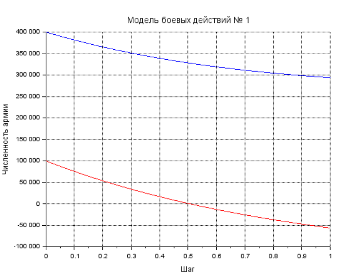
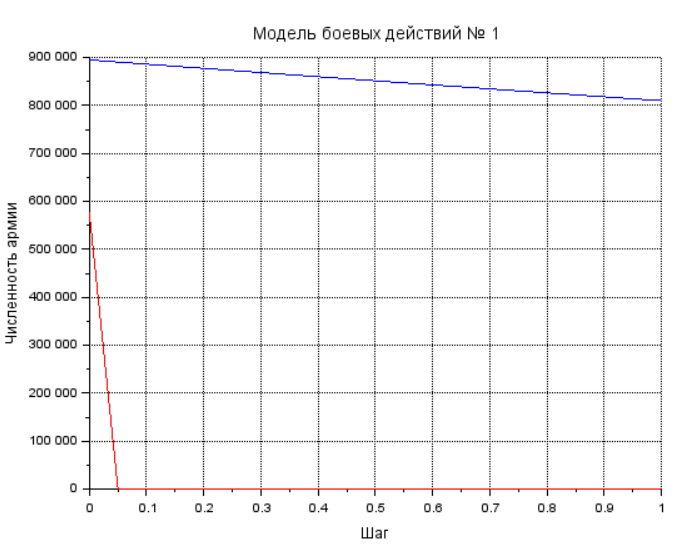
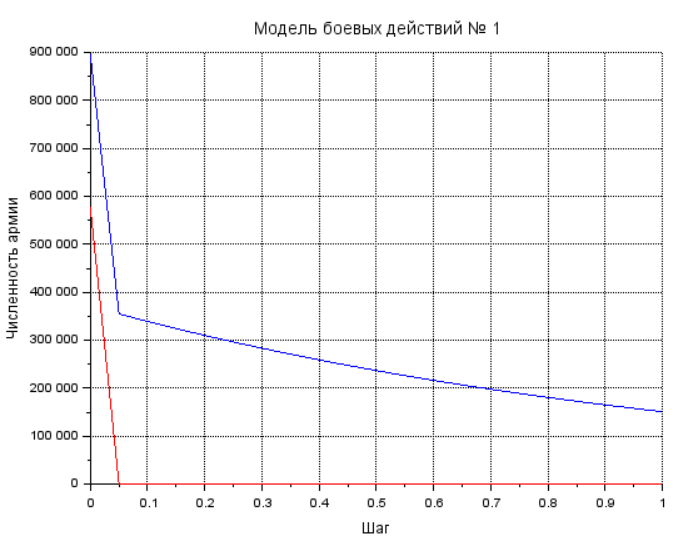

---
## Front matter
lang: ru-RU
title: Модель боевых действий
author: |
	 Котлярчук Екатерина НПИбд-01-19

institute: |
		Российский Университет Дружбы Народов

date: 26 февраля, 2022, Москва, Россия

## Formatting
mainfont: PT Serif
romanfont: PT Serif
sansfont: PT Sans
monofont: PT Mono
toc: false
slide_level: 2
theme: metropolis
header-includes: 
 - \metroset{progressbar=frametitle,sectionpage=progressbar,numbering=fraction}
 - '\makeatletter'
 - '\beamer@ignorenonframefalse'
 - '\makeatother'
aspectratio: 43
section-titles: true

---

# Цели и задачи работы

## Цель лабораторной работы

Рассмотрим некоторые простейшие модели боевых действий – модели Ланчестера. В противоборстве могут принимать участие, как регулярные войска, так и партизанские отряды. В общем случае главной характеристикой соперников являются численности сторон. Если в какой-то момент времени одна из численностей обращается в нуль, то данная сторона считается проигравшей (при условии, что численность другой стороны в данный момент положительна). 

## Задание к лабораторной работе

1. Изучить три случае модели Ланчестера
2. Построить графики изменения численности войск 
3. Определить победившую сторону

# Процесс выполнения лабораторной работы

## Теоретический материал 

Рассмотри три случая ведения боевых действий: 

1. Боевые действия между регулярными войсками
2. Боевые действия с участием регулярных войск и партизанских отрядов
3. Боевые действия между партизанскими отрядами 

## Теоретический материал 

В первом случае модель боевых действий между регулярными войсками описывается следующим образом

$$
 \begin{cases}
	\frac{dx}{dt}= -a(t)x(t) - b(t)y(t) + P(t)
	\\   
	\frac{dy}{dt}= -c(t)x(t) - h(t)y(t) + Q(t)
 \end{cases}
$$

## Теоретический материал 

Во втором случае в борьбу добавляются партизанские отряды. В результате модель принимает вид:

$$
 \begin{cases}
	\frac{dx}{dt}= -a(t)x(t) - b(t)y(t) + P(t)
	\\   
	\frac{dy}{dt}= -c(t)x(t)y(t) - h(t)y(t) + Q(t)
 \end{cases}
$$

## Теоретический материал 

Модель ведение боевых действий между партизанскими отрядами с учетом предположений, сделанных в предыдущем случаем, имеет вид:

$$
 \begin{cases}
	\frac{dx}{dt}= -a(t)x(t) - b(t)x(t)y(t) + P(t)
	\\   
	\frac{dy}{dt}= -h(t)y(t) - c(t)x(t)y(t) + Q(t)
 \end{cases}
$$

## Условие задачи

Между страной $X$ и страной $Y$ идет война. Численность состава войск исчисляется от начала войны, и являются временными функциями $x(t)$ и $y(t)$
В начальный момент времени страна $X$ имеет армию численностью 400 000 человек, а в распоряжении страны $Y$ армия численностью в 100 000 человек.
Для упрощения модели считаем, что коэффициенты $a, b, c, h$ постоянны. 
Также считаем $P(t), Q(t)$ непрерывные функции.
Постройте графики изменения численности войск армии $X$ и армии $Y$ для следующих случаев:

## Случай 1. Модель боевых действий между регулярными войсками

$$
 \begin{cases}
	\frac{dx}{dt}= -0.3x(t) - 0.2y(t) + sin(t)+2
	\\   
	\frac{dy}{dt}= -0.6x(t) - 0.45y(t) + cos(t)+3
 \end{cases}
$$

{ #fig:003 width=60% height=60% }

## Случай 2. Модель боевых действий между регулярными войсками

$$
 \begin{cases}
	\frac{dx}{dt}= -0.1x(t) - 0.88y(t) + sin(t)+2
	\\   
	\frac{dy}{dt}= -0.41x(t)y(t) - 0.41y(t) + 2*cos(t)+1
 \end{cases}
$$

{ #fig:004 width=60% height=60% }

## Случай 3. Модель боевых действий между партизанскими отрядами

$$
 \begin{cases}
	\frac{dx}{dt}= -0.9x(t) - 0.89x(t)y(t) + 2sin(t)+2
	\\   
	\frac{dy}{dt}= -0.8y(t) - 0.98x(t)y(t) + cos(t)+3
 \end{cases}
$$

{ #fig:004 width=70% height=70% }

# Выводы по проделанной работе

## Вывод

Мы познакомились с моделью боевых действий. 
Проверили, как работает модель в различных ситуациях, построили графики $y(t)$ и $x(t)$ для различных условий.